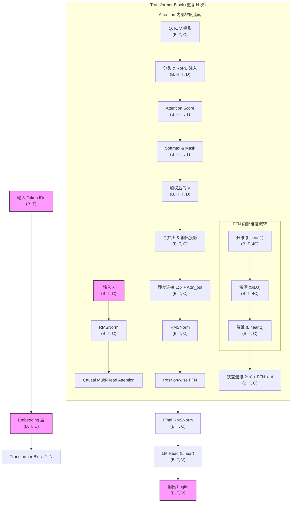

## 流程回顾
1. 先搞到一堆训练数据（正常人话就行）。
2. 选一套切分方案（比如 BPE，或者别的 tokenizer），根据这套方案，构建一个词汇表，用来把 token（字符串形式）映射到一个个整数 ID。
3. 用词表和 tokenizer 把原始文本啃一遍，变成一长串 ID 序列。
4. 把这些 ID 序列丢给模型（例如一个 Transformer），反复训练，最后得到一个“见过世面”的语言模型。
   
## 完成了前三步，接下来是重头戏 -- Transformer训练


这两张图展示了一个典型的**生成式 Transformer 语言模型**（类似于 GPT 架构）的整体架构及其核心组件。

这种设计是目前大语言模型（LLM）的主流标准，采用了**Pre-Norm（前置归一化）**和**RoPE（旋转位置编码）**等优化技术。

---

### 图 1：Transformer 语言模型概览 (Figure 1)

这张图展示了数据从输入到输出的宏观流动过程：

1. **Inputs (输入)：** 原始文本经过分词（Tokenization）转换成数字 ID。
2. **Token Embedding (词嵌入)：** 将数字 ID 映射为高维连续向量。
3. **Transformer Blocks (Transformer 块)：** 模型的核心，由  层重复的块堆叠而成。每一层都会对序列特征进行深层提取。
4. **Norm (归一化层)：** 在所有 Transformer 块结束后的最终归一化，用于稳定最后一层的输出。
5. **Linear / Output Embedding (线性层)：** 将向量维度映射回词表大小（Vocab Size）。
6. **Softmax (归一化指数函数)：** 将线性层的输出转换为 **Output Probabilities (输出概率)**，预测下一个 token 是什么的概率。

---

### 图 2：前置归一化 Transformer 块 (Figure 2)

这是图 1 中单个“Transformer Block”的内部细节。它采用了 **Pre-Norm** 结构，这比原始 Transformer 的 Post-Norm 训练起来更稳定。

该块包含两个主要子层：

#### 1. 注意力层 (Self-Attention)

* **Norm：** 进入注意力机制前先进行归一化。
* **Causal Multi-Head Self-Attention w/ RoPE：** * **Causal (因果)：** 确保模型在预测时只能看到当前 token 之前的词，不能“偷看”答案。
* **RoPE (Rotary Positional Embedding)：** 旋转位置编码。这是目前最流行的技术（如 Llama 使用），它能让模型更好地理解词与词之间的相对位置关系。


* **Add (残差连接)：** 将注意力层的输出与原始输入相加，防止梯度消失。

#### 2. 前馈网络层 (Feed-Forward)

* **Norm：** 再次进行归一化。
* **Position-Wise Feed-Forward：** 对每个位置的向量进行非线性变换（通常是两个全连接层中间加一个激活函数，如 GELU 或 SwiGLU）。
* **Add (残差连接)：** 再次进行残差相加，得到最终输出。

---


一个一个看


## **Embedding 层**

在 Transformer 中，模型无法直接处理“苹果”或“Apple”这样的文字，它只能处理数字。Embedding 层的作用就是把这些**数字索引**变成包含语义信息的**向量**。

---

### 1. 假设场景 (Setup)

假设我们的模型配置如下：

* **词表大小 (Vocab Size)**: 5 (为了简化，假设全天下只有 5 个词)
* `0: "I"`, `1: "love"`, `2: "coding"`, `3: "Python"`, `4: "<PAD>"`


* **嵌入维度 (d_model)**: 4 (每个词用 4 个数字表示)

此时，Embedding 层内部维护着一个 **权重矩阵**，形状为 `(5, 4)`。初始化后，它可能长这样（数值是随机初始化的）：

| Index | 向量 (Embedding Vector) |
| --- | --- |
| **0 ("I")** | `[ 0.12, -0.59, 0.88, 0.01]` |
| **1 ("love")** | `[ 0.45, 0.11, -0.33, 0.77]` |
| **2 ("coding")** | `[-0.98, 0.22, 0.54, -0.12]` |
| **3 ("Python")** | `[ 0.67, -0.44, 0.09, 0.32]` |
| **4 ("<PAD>")** | `[ 0.00, 0.00, 0.00, 0.00]` |

**这个权重矩阵也要参与训练！**
---

### 2. 输入 (Input)

输入是一组经过分词（Tokenizer）处理后的整数 ID。

* **输入张量形状**: `(batch_size, seq_len)`
> `batch_size`，`seq_len`是什么意思？
> 
> batch直接翻译是‘批’，这里表示一次输入多少句话
> 
> seq_len是序列长度，这里表示每个句子有多少个词
>
> **Batch Size 就是模型在一次训练迭代（更新一次参数）中所使用的样本数量**
>
> 从这里我们可以意识到一件事：在一个 batch 中的每个句子需要保持相同的长度（seq_len）
>
> 为了达到这一点，通常有两种做法：
>
> 1. 以句子为单位：使用 Padding 将不同长度的句子补齐到相同长度，或 使用 Truncation 截断过长句子。
> 2. 以长度为单位：不管句子边界，直接用“滑动窗口”切分固定长度的 Block（这在训练大语言模型时是标准做法）。
* **例子**: 我们输入一句话 "I love coding"，batch size 为 1。
* **数值形式**: `[[0, 1, 2]]`  (形状为 `1 x 3`)

---

### 3. 操作过程 (Lookup)

Embedding 层不做复杂的加减乘除，它只做 **“查表”**。

1. 看到第一个 ID 是 `0`，它就去权重矩阵里找第 0 行。
2. 看到第二个 ID 是 `1`，它就去权重矩阵里找第 1 行。
3. 看到第三个 ID 是 `2`，它就去权重矩阵里找第 2 行。

---

### 4. 输出 (Output)

输出是将查到的向量拼接在一起的结果。

* **输出张量形状**: `(batch_size, seq_len, d_model)`
* **对应本例的输出**:
```python
[
  [
    [ 0.12, -0.59, 0.88, 0.01],  # "I" 的向量
    [ 0.45, 0.11, -0.33, 0.77],  # "love" 的向量
    [-0.98, 0.22, 0.54, -0.12]   # "coding" 的向量
  ]
]

```


* **最终形状**: `(1, 3, 4)`

---

### 5. 实现？

1. **参数**: `self.weight = nn.Parameter(torch.randn(vocab_size, d_model))`。
2. **前向传播**: 使用 `self.weight[input_ids]` 进行索引取值。


## RMSNorm（均方根归一化）
**RMSNorm**（Root Mean Square Layer Normalization）是模型中非常关键的一个组件，它被用来替代经典的 LayerNorm。

你可以把它理解为一种**“更简洁、更高效的标准化技术”**。

### 1. 为什么需要 RMSNorm？

在深度神经网络中，随着层数的增加，每层输出的数值范围（激活值）可能会变得非常大或非常小，导致训练不稳定。

* **标准化 (Normalization)** 的目的就是将这些数值拉回到一个合理的范围内。
* **RMSNorm** 的核心思想是：我们不需要像 LayerNorm 那样计算均值（Mean），只需要计算**均方根（RMS）**。这样可以减少计算量，同时达到类似的训练效果。

### 2. 数学原理

对于一个输入的向量 （其维度为 ），RMSNorm 的处理步骤如下：

1. **计算均方根 (RMS)**：
计算该向量所有元素的平方的平均数，然后开根号。

$$RMS(x) = \sqrt{\frac{1}{d} \sum_{i=1}^{d} x_i^2}$$

2. **标准化 (Normalization)**：
用原向量除以这个 RMS 值。为了防止分母为 0，通常会加上一个极小的数值 （如 ）。

$$\bar{x}_i = \frac{x_i}{RMS(x) + \epsilon}$$

3. **缩放 (Scaling)**：
乘以一个可学习的增益参数 （Gamma）。

$$y_i = \gamma_i \cdot \bar{x}_i$$

### 3. 与经典 LayerNorm 的区别

* **LayerNorm**：要做两件事——“平移”（减去均值）和“缩放”（除以标准差）。
* **RMSNorm**：只做一件事——“缩放”（除以均方根）。
* **优点**：
* **计算更快**：省去了计算均值的步骤。
* **效果好**：在目前主流的大模型（如 Llama 2/3, Gopher 等）中，基本都选择了 RMSNorm，因为它在保持性能的同时能提供更好的数值稳定性。


### 4. 实现


* **输入输出形状**：输入是 `(batch_size, seq_len, d_model)`，输出形状保持一致。
* **参数**：你需要定义一个形状为 `(d_model,)` 的可学习参数 `weight`（即 $\gamma$）。 `weight` 可初始化为**全 1**。
* **计算维度**：注意！你应该在**最后一个维度**（即 $d_{model}$ 维度）上计算均方根，而不是在整个 batch 上。

### 5. 简单举例

假设你的输入向量是 `[3.0, 4.0]` ($d=2$)：

1. **平方和**：$3^2 + 4^2 = 9 + 16 = 25$
2. **平均值**：$25 / 2 = 12.5$
3. **均方根 (RMS)**：$\sqrt{12.5} \approx 3.53$
4. **标准化结果**：`[3.0/3.53, 4.0/3.53]` $\approx$ `[0.85, 1.13]`
5. **最后乘以**：如果 $\gamma$ 初始为 1，结果就是 `[0.85, 1.13]`。


## Scaled Dot-Product Attention
在 Transformer 架构中，**Scaled Dot-Product Attention（缩放点积注意力）** 是最核心的数学组件。它的任务是：让模型在处理当前词时，能够“注意到”句子中其他相关的词。

### 完整的数学公式

$$Attention(Q, K, V) = \text{softmax}\left(\frac{QK^T}{\sqrt{d_k}} + \text{mask}\right)V$$

我们来详细拆解这个过程。

### 1. 三个核心角色：Q, K, V

在计算注意力之前，输入向量会通过线性变换转换成三个矩阵：

* **Query (Q - 查询)**：代表“我正在寻找什么信息”。
* **Key (K - 键)**：代表“我这里有什么信息可以提供”。
* **Value (V - 值)**：代表“我具体包含的信息内容”。

---

### 2. 计算步骤（五步法）

假设输入的 $Q, K, V$ 的维度都是  $d_k$（通常等于 $d_{model} / num\_heads$）。

#### 第一步：计算相似度 (MatMul)

将 $Q$ 和 $K$ 的转置相乘：$QK^T$。

* **物理意义**：这一步是在计算当前词（Q）与序列中所有词（K）之间的相关性得分。得分越高，表示这两个词关系越紧密。

#### 第二步：缩放 (Scale)

将得分除以 $\sqrt{d_k}$。

* **为什么要缩放？** 这是标题中 "Scaled" 的由来。当维度  $d_k$ 很大时， $QK^T$ 的点积结果会变得非常大，导致经过 Softmax 后梯度变得极小（梯度消失）。除以 $\sqrt{d_k}$ 可以让数值分布更稳定，利于训练。

#### 第三步：掩码 (Mask - 仅针对 Decoder/LM)

在你的实验作业中，这是一个 **Causal（因果）** 语言模型。

* **操作**：在 Softmax 之前，将当前位置之后的得分设为 $-\infty$。
* **目的**：确保模型在预测第 $t$ 个词时，只能看到前 $t-1$ 个词，不能“偷看未来”。

#### 第四步：归一化 (Softmax)

对得分进行 Softmax 处理。

* **结果**：将得分转换为概率分布（总和为 1）。这代表了模型对不同位置信息的“注意力权重”。

#### 第五步：加权求和 (MatMul)

将注意力权重乘以 $V$：$Output = Softmax(...)V$。

* **结果**：根据权重把有用的信息提取出来。权重大的词，其  贡献就多。

---


### 4. 结合作业的输入与输出举例

假设：

* **输入**： 形状均为 `(batch_size, num_heads, seq_len, head_dim)`。
* **计算过程**：
1. `scores = (Q @ K.transpose(-2, -1)) / sqrt(head_dim)` -> 形状 `(B, H, T, T)`。
2. `scores = scores + mask`（将未来位置填为很小的负数）。
3. `weights = softmax(scores, dim=-1)` -> 得到注意力地图。
4. `out = weights @ V` -> 形状 `(B, H, T, head_dim)`。


### 总结

**Scaled Dot-Product Attention** 就像一个**智能滤波器**：

1. 它先看谁跟谁有关系（$QK^T$）。
2. 通过缩放和掩码调整权重（Scale & Mask）。
3. 最后按照关系的重要程度，重新组合信息（乘以 $V$）。

在作业中，你需要手动实现这个逻辑，特别要注意 **Mask** 的添加位置以及张量乘法的维度匹配。


## Causal Multi-Head Self-Attention
在完成 **Scaled Dot-Product Attention** 的基础上，理解 **Causal Multi-Head Self-Attention（因果多头自注意力）** 是构建 Transformer 语言模型最关键的一步。

这个组件可以拆解为两个核心词：**Multi-Head（多头）** 和 **Causal（因果）**。

### 1. 为什么要“多头” (Multi-Head)？

如果只用一个注意力头，模型只能关注到一种关系（比如只关注主语和谓语）。“多头”机制允许模型在不同的**表示子空间**里同时学习多种关系：

* 第一个头可能关注**语法结构**。
* 第二个头可能关注**代词指代**。
* 第三个头可能关注**词与词之间的长距离依赖**。

**实现方式：**

1. 将 $d_{model}$ 维度的向量拆分成 $h$ 个小向量（每个维度为 $d_k = d_{model} / h$）。
2. 并行地在  $h$ 个头上运行注意力计算。
3. 将所有头的输出拼接（Concatenate）起来，最后通过一个线性层投影回 $d_{model}$ 维度。

---

### 2. 什么是“因果” (Causal)？

在生成式语言模型（如 GPT 或你作业中的模型）中，我们的任务是“根据上文预测下一个词”。

* **问题**：在训练时，我们把整句话一次性输入模型。如果不加限制，第 2 个词的 $Q$ 就会看到第 5 个词的 $K$，这等于是“偷看答案”。
* **解决方法**：加入**因果掩码 (Causal Mask)**。
* **操作**：在计算  的得分矩阵时，我们将右上角（即未来位置）的所有得分替换为 $-\infty$。这样经过 Softmax 后，这些位置的权重变为 0。

---

### 3. 加入举例：输入与输出的详细流程

假设参数：

* `batch_size (B) = 1`
* `seq_len (T) = 4` ("I", "love", "AI", "models")
* `d_model = 128`
* `num_heads (H) = 4` (每个头维度 `d_k = 32`)

#### 第一步：线性投影 (Projection)

输入形状为 `(1, 4, 128)`。我们通过三个线性层分别得到 。
然后将形状重排（Reshape）为：`(1, 4, 4, 32)` -> 调整顺序为 `(batch, head, seq_len, head_dim)` 即 `(1, 4, 4, 32)`。

#### 第二步：计算注意力得分

在每个头内部，计算 ，得到形状为 `(1, 4, 4, 4)` 的得分矩阵。
这个 `4x4` 的矩阵代表了 4 个词两两之间的关系。

#### 第三步：应用因果掩码 (The Causal Mask)

掩码矩阵如下（1 表示可见，0 表示掩盖）：

```
[[1, 0, 0, 0],  # "I" 只能看到自己
 [1, 1, 0, 0],  # "love" 看到 "I" 和 "love"
 [1, 1, 1, 0],  # "AI" 看到前三个词
 [1, 1, 1, 1]]  # "models" 看到全部

```

得分矩阵中对应 `0` 的位置会被填入 `-inf`，确保信息流只能从过去流向未来。

#### 第四步：加权与拼接

将掩码后的得分与  相乘，得到 4 个头的输出。
拼接后形状恢复为 `(1, 4, 128)`。

#### 第五步：最后的线性投影 (Output Projection)

通过一个最后的线性层 $W^O$，将多头收集到的信息进行融合。

---

### 4. 手册中的特别提醒 (RoPE)

在计算完 $Q$ 和 $K$ 后、计算得分前，需要应用 **Rotary Positional Embedding (RoPE)**。

* **位置信息**：单纯的注意力机制无法区分词的顺序（“我爱你”和“你爱我”得分一样）。
* **RoPE**：通过旋转向量的方式，把位置信息编码进  和 。这是目前最先进的 Transformer 做法。

### 总结

**Causal Multi-Head Self-Attention** 是一个“既要博采众长（多头），又要守规矩（因果）”的机制：

* **多头**：提供多角度的视野。
* **因果**：防止模型在预测时作弊。
* **输出**：每个 Token 现在都包含了其左侧所有相关上下文的精炼信息。

## RoPE(Rotary Positional Embedding)
在你的 CS336 实验手册中，**RoPE (Rotary Positional Embedding，旋转位置编码)** 是自注意力机制中非常关键的一个环节。它是目前 Llama、Mistral 和 DeepSeek 等主流大模型（LLM）标配的位置编码技术。

### 1. 为什么需要位置编码？

在 Transformer 的自注意力机制中，矩阵运算是对称的。如果没有位置信息，模型看“我爱你”和“你爱我”是一模一样的。

* **传统方法 (Absolute PE)**：在输入 Embedding 上直接加一个表示位置的向量。
* **RoPE 的进步**：它是一种**相对位置编码**。它不改变词的含义，而是通过“旋转”向量的方式，让模型根据两个词之间**旋转角度的差异**来感知它们的距离。

---

### 2. 核心直觉：旋转与角度

想象每个 Token 的向量是一个在多维空间里的点。RoPE 的核心思想是：

1. **位置 = 旋转**：第 $m$ 个位置的 Token，我们把它在空间里旋转 $m\theta$ 角度。
2. **距离 = 角度差**：当第 $m$ 个位置的 Query 和第 $n$ 个位置的 Key 进行点积（计算注意力）时，结果只取决于它们之间的相对角度  $(m-n)\theta$。

---

### 3. 数学实现（两两分组）

RoPE 的应用逻辑可以分为：预计算频率、向量旋转、点积计算三个阶段。
1. 准备阶段：预计算旋转频率 (Precomputing)
   在模型初始化时，我们会根据最大序列长度和维度，预先算好一个“旋转角速度”矩阵。
   -  对于 $d_{head}$ 维度的向量，我们两两分组，共分 $d/2$ 组。
   -  每一组都有一个不同的基础频率 $\theta_i$（事先规定）。
   -  对于位置 $m$，该维度的旋转角度就是 $m \cdot \theta_i$。
  
2. 执行阶段：对 Q 和 K 进行旋转 (Applying RoPE)
   在每个 Transformer Block 的注意力层内部，具体步骤如下：
   1. 投影生成 Q, K, V：
   - 输入经过线性层，得到 $Q$ 和 $K$。此时它们的形状通常是 (batch, num_heads, seq_len, head_dim)。
   2. 两两配对：
   - 将 $head\_dim$ 维度的向量拆开。
   - 比如一个向量是 $[x_0, x_1, x_2, x_3]$，我们把它看成两对坐标：$(x_0, x_1)$ 和 $(x_2, x_3)$。
   3. 坐标旋转：对于位置 $m$ 的第 $i$ 对坐标，应用旋转矩阵运算：
$$\begin{pmatrix} x'_{2i} \\ x'_{2i+1} \end{pmatrix} = \begin{pmatrix} \cos(m\theta_i) & -\sin(m\theta_i) \\ \sin(m\theta_i) & \cos(m\theta_i) \end{pmatrix}\begin{pmatrix} x_{2i} \\ x_{2i+1} \end{pmatrix}$$

注意： 只有 $Q$ 和 $K$ 需要旋转，$V$ 保持原样不动。

3. 计算阶段：带位置信息的注意力分数 (Attention Score)
   - 旋转完成后，我们进入标准的 Scaled Dot-Product Attention 流程：
   - 点积：计算 $Q_{rotated} \times K_{rotated}^T$。
   - 奇妙之处：因为 $Q$ 和 $K$ 都携带了旋转角度，当它们相乘时，数学上会发生“角度抵消”：$$\text{Score}(m, n) \propto \cos(m\theta - n\theta) = \cos((m-n)\theta)$$
   - 这意味着： 最终的注意力分数，天然地包含了两词之间的相对距离 $(m-n)$。
   - 后续步骤：接下来的 Mask（掩码）、Softmax 和 乘以 V 的过程与普通注意力完全一致。

---


### 4. RoPE 的优点

1. **外推性 (Extrapolation)**：由于它是基于相对角度的，模型在推理时处理比训练时长一点的句子，表现会比绝对位置编码更稳健。
2. **衰减性**：随着两个词的距离增加，它们之间的注意力得分会自然地出现某种程度的衰减，这符合人类语言的逻辑。

### 总结

在你的作业里，RoPE 就像给每个 Token 戴上了一块**带有独特角度的磁铁**：

* 当 Q 和 K 靠近时，它们的磁场（角度）对齐得更好，点积得分越高。
* 这个“角度”完全是由它们在句子中的索引（0, 1, 2...）决定的。


---
## SoftMax
$$softmax(v)i= exp(vi) ∑nj=1exp(vj)$$
过

---

到现在为止，我们已经把Transformer LM的所有组件都搭建好了。


符号定义：
- B (Batch Size)：批大小（同时处理的句子数）。
- T (Sequence Length / Time)：序列长度（每句话的单词数）。
- C (d_model / Channels)：模型的隐藏层维度（嵌入维度）。
- V (Vocab Size)：词表大小。
- H (Num Heads)：多头注意力的头数。
- D (head_dim)：每个头的维度（满足 $H \times D = C$）。



维度变换关键点详细解析：
1. Attention 中的维度压缩与恢复
   - 分头 (Split Heads)：你会把 (B, T, C) 重新排列（Reshape）为 (B, T, H, D)，然后为了计算方便，通常交换维度（Transpose）成 (B, H, T, D)。
   - 点积 (Dot Product)：$Q(B, H, T, D)$ 乘以 $K^T(B, H, D, T)$，结果是 (B, H, T, T)。这个 $T \times T$ 的矩阵代表了序列中每个词对其他词的关注度。
   - 合并 (Concat)：计算完后，将 (B, H, T, D) 转回 (B, T, C)。
2. RoPE 的注入位置
   - 位置：RoPE 作用在 (B, H, T, D) 阶段。它在 $Q$ 和 $K$ 被拆分后、进行点积计算前应用。
   - 形状：你的频率矩阵（$\cos$ 和 $\sin$）需要能够通过广播（Broadcast）机制作用于 $T$（长度）和 $D$（头维度）上。
3. FFN 的“升维”与“降维”
   - 在 Transformer 中，前馈网络通常会先将维度扩大（通常是 4 倍，即 4C），然后再缩减回 C。
   - 输入：(B, T, C)
   - 升维后：(B, T, 4C) —— 目的是为了在更高维的空间进行非线性特征提取。
   - 降维后：(B, T, C) —— 目的是为了能与残差连接的输入进行相加。
4. 最后的 Logits
   - LM Head 实际上是一个巨大的全连接层：Linear(in_features=C, out_features=V)。
   - 它将每一个 Token 的 $C$ 维特征向量，投影到 $V$（词表大小）个维度上。每一个维度的数值大小（Logit）就代表了该词作为下一个词出现的可能性。