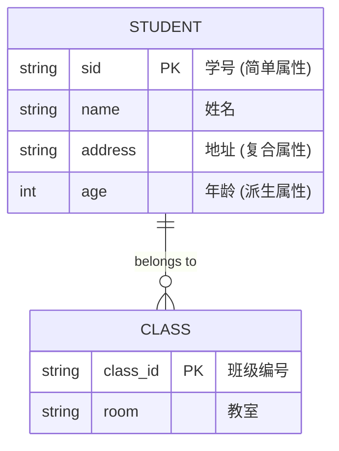
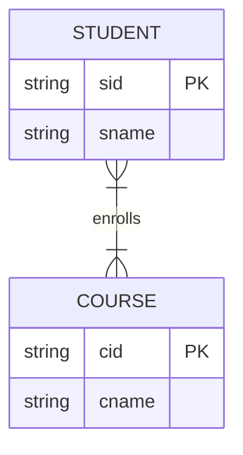
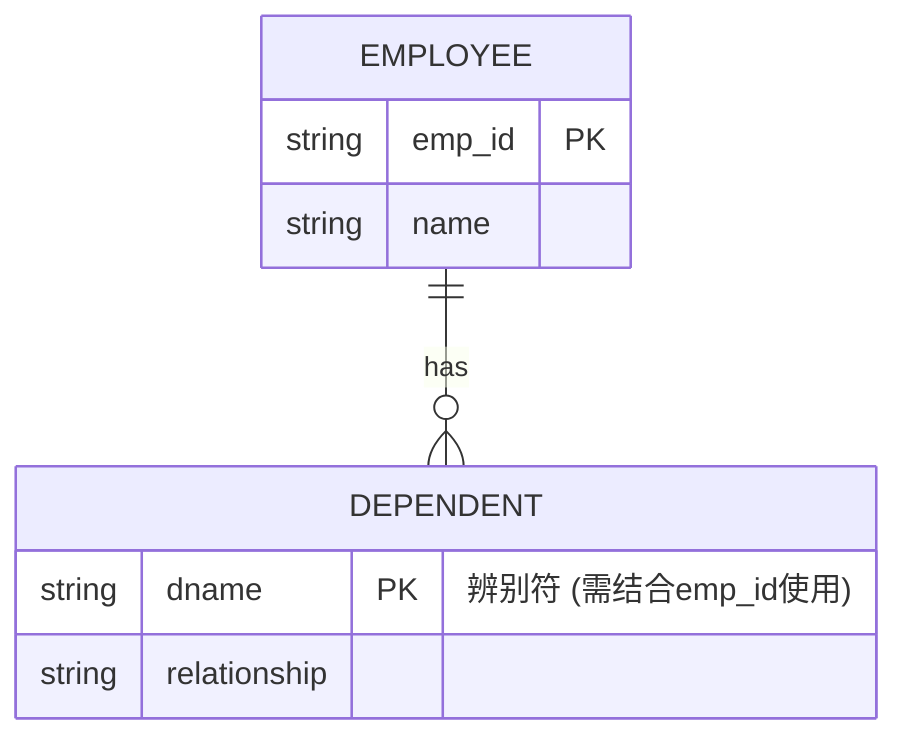
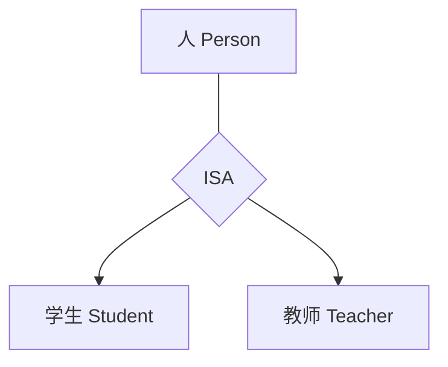

### 一、 数据管理基础概念

* **数据管理**：指对数据进行组织、存储、检索和维护的过程 。

* *形象比喻*：就像一位**图书管理员**，不仅要负责把书放进书架，还要负责编目（定义）、帮读者找书（查询）以及修补破损书籍（维护）。

* **数据定义 (DDL)**：描述数据的逻辑结构、物理结构及完整性约束 。

* **数据操作 (DML)**：对数据进行查询、插入、删除和修改 。

* **数据约束**：为保证数据正确、有效而设置的规则，如“死亡日期不能早于出生日期” 。

* **数据结构**：
* **逻辑结构**：用户看到的、逻辑上的数据组织形式，如**表格、树、图** 。

* **物理结构**：数据在磁盘上的实际存储方式，如**顺序存储、链式存储** 。

* **数据类型**：限定数据的变化范围，如整数、字符、布尔值等 。

* **数据独立性**：当数据结构改变时，应用程序无需修改（就是数据库给程序提供的**接口**不变）。

* **逻辑独立性**：数据的逻辑结构改变（如增加一个字段）时，程序不变 。

* **物理独立性**：数据的存储结构改变（如从机械硬盘换到SSD，或改变索引）时，程序不变 。

* *形象说明*：就像**更换电源插头**。只要插座标准（接口）不变，无论背后是火力发电还是水力发电（物理层），你的电器（应用程序）都能正常工作。
  
---

### 二、 数据管理的发展历程

1. **人工管理阶段**：外存设备主要是磁带、卡片、纸带等顺序存取设备，没有磁盘。程序和数据紧密结合。如果数据的存储结构（如磁带换成纸带）发生了细微变化，程序就必须重写，缺乏数据独立性。

2. **文件系统阶段**：有了操作系统管理文件，但数据冗余大，共享困难，且缺乏结构化 。

* *举例*：劳资科和人事科各自存了一份“张三”的信息。张三改名后，如果只改了人事科的，劳资科还是旧名，导致**数据不一致** 。

3. **数据库系统阶段**：数据面向全组织，由DBMS统一管理，共享性高，独立性强 。

4. **大数据时代**：不仅关注结构化数据，还涉及海量、多模态（文本、图像等）数据的统计与计算 。

---
### 三、 数据模型 (Data Model)

数据模型是数据库系统的形式框架 。

* **概念数据模型**：按用户的观点建模（如**E-R模型**），是现实世界到信息世界的抽象 。

* **结构数据模型**：按计算机实现的观点建模 。其**三要素**包括：

1. **数据结构**：系统的静态特性（如表、节点） 。

2. **数据操作**：系统的动态特性（检索、更新） 。

3. **数据完整性约束**：正确性规则的集合 。

#### 常见的结构数据模型：

* **层次模型**：用**树结构**表示，像家谱一样，每个节点只有一个父节点 。

* **网状模型**：用**有向图**表示，节点可以有多个父节点，结构复杂但效率高 。

* **关系模型**：用**二维表**表示，直观、易懂，有坚实的理论基础（目前主流） 。

* **面向对象模型**：支持复杂实体和用户自定义类型，如支持嵌套表 。

---

### 四、 数据库系统的架构与模式

* **元数据 (Metadata)**：描述数据的数据（如字段名、数据类型） 。

* *形象说明*：罐头上的**标签**。罐头里是“数据”（桃子），标签上的“净含量、配料表”就是“元数据”。

* **模式 (Schema)**：数据的抽象描述，具有相对稳定性；**实例 (Instance)** 是某一时刻的具体值 。

* **数据字典**：存储所有模式定义、权限等元数据的地方，是DBMS运行的依据 。

数据库系统的三级模式结构 ：

1. **外模式 (External Schema)**：用户看到的局部逻辑结构（视图） 。

2. **模式 (Schema)**：全体数据的全局逻辑结构（所有基本表的集合） 。

3. **内模式 (Internal Schema)**：数据的物理结构和存储方式（如索引、压缩） 。

| 级别 | 对应角色 | 关注点 | 形象比喻 |
| --- | --- | --- | --- |
| **外模式** | 用户 / 程序员 | 我想看什么？ | **菜单上的精选组合** |
| **模式** | 数据库管理员 (DBA) | 我们有什么？ | **仓库里的总物料清单** |
| **内模式** | 数据库引擎 | 怎么放得快、存得多？ | **货架布局和存储规格** |

#### 两级映像功能：

* **外模式/模式映像**：保证**逻辑独立性** 。

* **模式/内模式映像**：保证**物理独立性** 。

* **视图 (View)**：
    * **虚视图**：不存储数据，仅保存定义（外模式常用） 。

    * **实视图（物化视图）**：为了提高效率，将视图查询的结果实际存储起来 。

---

### 五、 数据库系统组成与 DBMS

* **数据库 (DB)**：数据的集合 。

* **数据库管理系统 (DBMS)**：管理数据库的系统软件 。

* **数据库系统 (DBS)**：包含DB、DBMS、硬件、应用程序和**数据库管理员 (DBA)** 的整体 。

* **DBMS 层次系统**：从上到下通常分为：应用层 → 语言翻译处理层 → 数据存取层 → 数据存储层 → 操作系统 。

* *形象比喻*：DBMS就像一家**餐厅**。应用层是“点菜员”，翻译层是“菜单翻译/传菜”，存取层是“厨师”，存储层是“仓库/冰箱”。

---
---

---

### 1. 核心组件 (Basic Components)

ER 模型主要由三种基本元素构成：实体、属性和联系。

* **实体 (Entity)**：客观存在且可相互区别的事物。
* **属性 (Attribute)**：实体的特性。
* **联系 (Relationship)**：实体之间的关联。

#### 示例图：学生与班级的基本联系
在这个图中，矩形代表实体，椭圆代表属性，菱形代表联系。

---

### 2. 属性的细分类型 (Attribute Types)

讲义中特别强调了属性的多种形态：

* **简单属性 vs 复合属性**：
    * *例子*：`姓名`是简单的；而`通信地址`可以拆分为省、市、区，这就是**复合属性**。
* **单值属性 vs 多值属性**：
    * *例子*：一个人通常只有一个`身份证号`（单值），但可以有多个`手机号`（**多值属性**，在图中常用双线椭圆表示）。
* **派生属性**：
    * *例子*：数据库只存`出生日期`，而`年龄`是通过计算得到的，称为**派生属性**。

---

### 3. 联系的基数 (Cardinality)

基数定义了一个实体能与另一个实体集关联的数量限制。

* **一对一 (1:1)**：如“一个部长对应一个部门”。
* **一对多 (1:N)**：如“一个系有多个教师”。
* **多对多 (M:N)**：如“学生与课程”。

#### 示例图：多对多联系 (M:N)
在 Mermaid 中，`}|--|{` 表示多对多关系。

---

### 4. 弱实体集 (Weak Entity Set)

**概念**：有些实体没有足够的属性来形成主码，必须依赖于另一个“强实体”而存在。
* **辨别符 (Discriminator)**：弱实体内部用来区分彼此的属性（也叫部分码）。
* **例子**：`员工`是强实体，`家属`是弱实体。如果员工离职，家属信息也就失去了存在的意义。

---

### 5. 扩展 ER 特性 (Extended ER Features)

讲义中提到了高级建模概念：

* **特化与概化 (Specialization / Generalization)**：即“父子类”继承关系。用 **ISA** 表示。
    * *例子*：`人`可以概化`学生`和`教师`。
* **聚集 (Aggregation)**：将一个“联系”看作一个整体，再与其他实体建立联系。

#### 示例图：概化 (Inheritance)

---

### 6. 转换规则：ER 图如何变数据库表

这是讲义中非常实用的部分，总结如下：

1.  **强实体** $\rightarrow$ 独立表。
2.  **多值属性** $\rightarrow$ 必须单独建表（例如：学生电话表）。
3.  **M:N 联系** $\rightarrow$ 必须产生一个**联系表**，包含两端实体的主码。
4.  **1:N 联系** $\rightarrow$ 通常在“多”的一端添加“一”端的主码作为外键。

---

### 7. 特殊：时态建模 (Temporal Modeling)

讲义最后提到的一个高级点：当我们需要记录历史（例如：员工在不同时间段属于不同部门）时，我们会把**“动态联系”**变成**“静态实体记录”**。

* **做法**：引入“起始时间”和“结束时间”。
* **意义**：这样一条记录就代表了一个人某一段时期的任职状态，从而支持历史轨迹查询。

---
ER模型基本概念：

实体

属性

联系

码

ER图

实体 属性 域

超码，候选码，主码

属性类型：复合 多值 派生 NULL

联系基数：一对一 一对多 多对多 势

参与 角色 复合实体 存在依赖

扩展ER特性：聚集 特化 概化 弱实体

